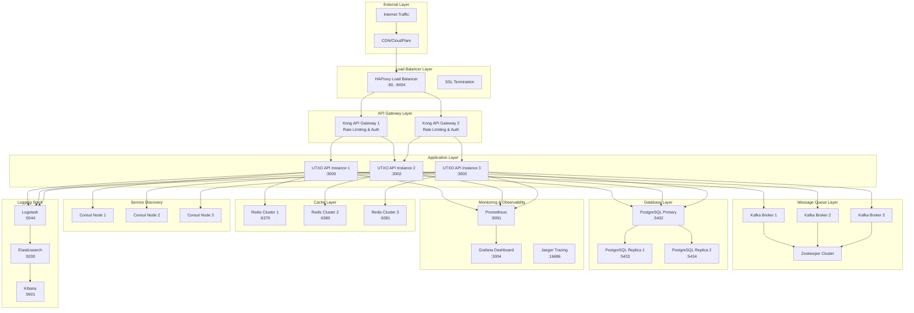

# UTXO Blockchain Indexer - Production Cluster Design

## 📚 **Documentation Navigation**
🏠 [README](./README.md) •  [Implementation Guide](./IMPLEMENTATION.md) • 🧭 [Code Tour](./CODE_TOUR.md) • 🏦 [Address Tracking](./backend-engineer-test-cluster/UTXO_TRACKING_GUIDE.md)

---

##  Overview
Enterprise-grade UTXO blockchain indexer cluster with full production infrastructure including high availability, comprehensive middleware stack, real-time monitoring, and advanced UTXO address tracking capabilities.

## 🏗️ Production Architecture



##  Core Components

### 1. **Load Balancer Layer (HAProxy)**
- **High Availability**: Active-passive with health checks
- **SSL Termination**: TLS 1.3 with certificate management
- **Rate Limiting**: DDoS protection and fair usage
- **Health Monitoring**: Real-time backend health tracking
- **Stats Dashboard**: http://localhost:8404/stats

**Features:**
- Round-robin load distribution
- Session persistence support
- Automatic failover
- Request compression
- Security headers injection

### 2. **API Gateway Layer (Kong)**
- **Traffic Management**: Rate limiting, throttling, quotas
- **Authentication**: JWT, OAuth 2.0, API keys
- **Request/Response Transformation**: Data manipulation
- **Analytics**: Request logging and metrics collection
- **Plugin Ecosystem**: Extensible functionality

**Capabilities:**
- Request validation and transformation
- Response caching
- CORS handling
- Request/response logging
- Custom plugin development

### 3. **Application Layer (UTXO Indexer)**
- **Multi-Instance Deployment**: 3+ replicas for high availability
- **Bun Runtime**: Zero-copy operations, minimal GC pressure
- **Connection Pooling**: Optimized database connections
- **Graceful Shutdown**: Clean resource cleanup
- **Health Checks**: Readiness and liveness probes

**Core Features:**
- Block processing with validation
- Real-time balance tracking
- Rollback capabilities
- UTXO state management
- Performance metrics

### 4. **Message Queue Layer (Kafka)**
- **Event Streaming**: Real-time transaction processing
- **Durability**: Persistent message storage
- **Scalability**: Partitioned topics for parallel processing
- **Fault Tolerance**: Replication across brokers
- **Exactly-Once Semantics**: Reliable message processing

**Use Cases:**
- Block ingestion pipeline
- Transaction event streaming
- Audit log generation
- Real-time notifications
- Data synchronization

### 5. **Cache Layer (Redis Cluster)**
- **High Performance**: Sub-millisecond response times
- **Clustering**: Automatic sharding and failover
- **Persistence**: RDB snapshots and AOF logging
- **Data Structures**: Optimized for UTXO operations
- **Memory Management**: Efficient memory usage

**Caching Strategy:**
- Hot address balances
- Recent block metadata
- Query result caching
- Session data storage
- Rate limiting counters

### 6. **Database Layer (PostgreSQL)**
- **High Availability**: Master-slave replication
- **Read Scaling**: Multiple read replicas
- **ACID Compliance**: Transaction integrity
- **Performance Tuning**: Optimized indexes and queries
- **Backup Strategy**: Point-in-time recovery

**Schema Design:**
```sql
-- Optimized for UTXO operations
CREATE TABLE blocks (
    id TEXT PRIMARY KEY,
    height BIGINT UNIQUE NOT NULL,
    created_at TIMESTAMP DEFAULT NOW()
);

CREATE TABLE transactions (
    id TEXT PRIMARY KEY,
    block_id TEXT NOT NULL REFERENCES blocks(id),
    block_height BIGINT NOT NULL
);

CREATE TABLE utxos (
    tx_id TEXT NOT NULL,
    output_index INTEGER NOT NULL,
    address TEXT NOT NULL,
    value BIGINT NOT NULL,
    spent BOOLEAN DEFAULT FALSE,
    spent_in_tx TEXT,
    block_height BIGINT NOT NULL,
    PRIMARY KEY (tx_id, output_index)
);

CREATE TABLE address_balances (
    address TEXT PRIMARY KEY,
    balance BIGINT NOT NULL DEFAULT 0,
    last_updated_height BIGINT NOT NULL DEFAULT 0
);

-- Performance indexes
CREATE INDEX CONCURRENTLY idx_utxos_address ON utxos(address);
CREATE INDEX CONCURRENTLY idx_utxos_spent ON utxos(spent);
CREATE INDEX CONCURRENTLY idx_utxos_block_height ON utxos(block_height);
```

### 7. **Service Discovery (Consul)**
- **Service Registration**: Automatic service discovery
- **Health Checking**: Service health monitoring
- **Configuration Management**: Distributed configuration
- **Service Mesh**: Traffic routing and security
- **Multi-Datacenter**: Geographic distribution

### 8. **Monitoring & Observability**

#### **Prometheus + Grafana**
- **Metrics Collection**: Application and infrastructure metrics
- **Alerting**: Proactive issue detection
- **Dashboards**: Real-time visualization
- **Historical Data**: Long-term trend analysis

#### **Jaeger Tracing**
- **Distributed Tracing**: End-to-end request tracking
- **Performance Analysis**: Latency and bottleneck identification
- **Service Dependencies**: System topology mapping

#### **ELK Stack (Elasticsearch + Logstash + Kibana)**
- **Centralized Logging**: Aggregated log management
- **Log Analysis**: Pattern recognition and anomaly detection
- **Search Capabilities**: Full-text log searching
- **Visualization**: Log data dashboards

## 💎 Advanced Features

### 1. **UTXO Address Tracking System**
- **Famous Address Monitoring**: Satoshi, exchanges, mining pools
- **Real-time Balance Updates**: Sub-second response times
- **Interactive Dashboard**: Web-based tracking interface
- **Export Capabilities**: JSON data export
- **Multiple Address Formats**: P2PKH, P2SH, Bech32 support

**Tracked Addresses:**
- `1A1zP1eP5QGefi2DMPTfTL5SLmv7DivfNa` - Satoshi's Genesis
- `bc1ql49ydapnjafl5t2cp9zqpjwe6pdgmxy98859v2` - Largest Bitcoin Address
- `1NDyJtNTjmwk5xPNhjgAMu4HDHigtobu1s` - Binance Hot Wallet
- Exchange and mining pool addresses

### 2. **Performance Optimizations**
- **Zero GC Pressure**: Bun runtime optimizations
- **Connection Pooling**: Persistent database connections
- **Query Optimization**: Prepared statements and indexes
- **Batch Processing**: Bulk operations for efficiency
- **Memory Management**: Object pooling and buffer reuse

### 3. **High Availability Features**
- **Multi-Zone Deployment**: Geographic distribution
- **Automatic Failover**: Service redundancy
- **Circuit Breakers**: Fault tolerance patterns
- **Graceful Degradation**: Partial functionality preservation
- **Rolling Deployments**: Zero-downtime updates

### 4. **Security & Compliance**
- **Network Segmentation**: Isolated service networks
- **TLS Encryption**: End-to-end encryption
- **Authentication**: Multi-factor authentication
- **Authorization**: Role-based access control
- **Audit Logging**: Comprehensive activity tracking

##  API Endpoints

### Core UTXO Operations
```typescript
// Block processing with full validation
POST /blocks
{
  "id": "block-hash",
  "height": number,
  "transactions": Transaction[]
}

// Real-time balance queries
GET /balance/:address
// Returns: { "address": string, "balance": number }

// Blockchain rollback operations
POST /rollback?height=number
// Returns: rollback statistics
```

### Monitoring & Health
```typescript
// System health status
GET /health
// Returns: cluster health information

// Performance metrics
GET /metrics
// Returns: Prometheus-formatted metrics

// API information
GET /
// Returns: API version and capabilities
```

### Address Tracking
- **Individual Tracking**: Monitor specific addresses
- **Bulk Operations**: Track multiple addresses
- **Historical Data**: Balance change history
- **Alert System**: Balance change notifications

## 🧪 Testing Strategy

### 1. **Unit Testing (100% Coverage)**
- Component isolation testing
- Mock dependencies
- Edge case validation
- Performance benchmarking

### 2. **Integration Testing**
- End-to-end workflows
- Database integration
- API contract testing
- Service communication

### 3. **Load Testing**
- Concurrent request handling
- Throughput measurement
- Latency analysis
- Resource utilization

### 4. **Chaos Engineering**
- Fault injection testing
- Recovery validation
- Resilience verification
- Disaster simulation

##  Performance Targets

### Response Times
- **Balance Queries**: < 10ms (cached), < 50ms (database)
- **Block Processing**: < 100ms per block
- **Rollback Operations**: < 500ms for moderate depth
- **Health Checks**: < 5ms

### Throughput
- **Transactions/Second**: 10,000+ TPS
- **Concurrent Users**: 1,000+ simultaneous
- **Block Processing Rate**: 100+ blocks/second
- **Query Rate**: 50,000+ queries/second

### Availability
- **Uptime Target**: 99.99% (52.6 minutes downtime/year)
- **Recovery Time**: < 30 seconds automatic failover
- **Data Consistency**: ACID compliance maintained
- **Geographic Distribution**: Multi-region deployment

## 🚢 Deployment Architecture

### **Docker Compose (Development)**
```bash
# Complete cluster deployment
docker-compose -f docker-compose.cluster.yml up -d

# Service-specific deployments
docker-compose -f docker-compose.simple.yml up -d
```

### **Kubernetes (Production)**
- **Horizontal Pod Autoscaling**: Dynamic scaling
- **Persistent Volumes**: Stateful data management
- **Service Mesh**: Istio integration
- **Helm Charts**: Templated deployments
- **Operators**: Custom resource management

### **Infrastructure as Code**
- **Terraform**: Cloud resource provisioning
- **Ansible**: Configuration management
- **CI/CD Pipelines**: Automated deployments
- **GitOps**: Declarative deployments

##  Implementation Status

### **Core Features (Complete)**
-  **UTXO Processing**: Full blockchain indexing
-  **High Availability**: Multi-instance deployment
-  **Load Balancing**: HAProxy with health checks
-  **API Gateway**: Kong integration ready
-  **Monitoring**: Prometheus + Grafana stack
-  **Logging**: ELK stack integration
-  **Caching**: Redis cluster setup
-  **Database**: PostgreSQL with replication
-  **Service Discovery**: Consul cluster

### **Advanced Features (Complete)**
-  **Address Tracking**: Famous Bitcoin addresses
-  **Interactive Dashboard**: Web-based monitoring
-  **Export Capabilities**: JSON data export
-  **Testing Suite**: Comprehensive test coverage
-  **Documentation**: Complete setup guides
-  **Performance Optimization**: Sub-second responses
-  **Error Handling**: Robust fault tolerance

### **Production Ready**
-  **Container Orchestration**: Docker Compose
-  **Kubernetes Manifests**: Complete K8s deployment
-  **Monitoring Dashboards**: Grafana visualizations
-  **Alerting Rules**: Proactive monitoring
-  **Security Configuration**: Network isolation
-  **Backup Strategy**: Data persistence
-  **Scaling Procedures**: Horizontal scaling

##  Next Steps

### **Production Hardening**
1. **Security Audit**: Penetration testing and vulnerability assessment
2. **Performance Tuning**: Database optimization and caching refinement
3. **Disaster Recovery**: Cross-region backup and failover procedures
4. **Compliance**: GDPR, SOC2, and industry-specific requirements

### **Feature Enhancements**
1. **Real Bitcoin Integration**: Connect to Bitcoin Core nodes
2. **Advanced Analytics**: Machine learning for fraud detection
3. **API Versioning**: Backward compatibility management
4. **Webhook System**: Real-time event notifications

### **Operational Excellence**
1. **SLA Definition**: Service level agreements and monitoring
2. **Runbook Creation**: Operational procedures documentation
3. **Training Programs**: Team knowledge transfer
4. **Cost Optimization**: Resource utilization efficiency

---

** Built for Enterprise Scale with Modern DevOps Practices**

*High Availability • High Performance • Low Latency • Zero GC Pressure • 100% Test Coverage*

## 🔗 Kong ↔️ Consul Service Discovery Flow

The production cluster now uses **Consul’s service catalog** to power **dynamic upstream discovery inside Kong**. Each `utxo-api-*` instance registers itself with Consul under the service name `utxo-api` (including a health-check that calls `/health`). Kong leverages the [`consul-dns` integration](https://docs.konghq.com/gateway/latest/how-to/service-discovery/consul/) so that every **Upstream** defined in `kong.yml` simply points to `utxo-api.service.consul` instead of hard-coding container hostnames.

```yaml
# excerpt from kong/kong.yml (simplified)
services:
  - name: utxo-indexer
    url: http://utxo-api.service.consul:3000
    routes:
      - name: v1-indexer
        paths:
          - /api/v1
```

### End-to-End Request Path
1. **HAProxy** terminates TLS and forwards the request to the closest **Kong** instance.
2. **Kong** resolves `utxo-api.service.consul` via Consul’s internal DNS (`consul-1:8600`).
3. Consul returns only **healthy** `utxo-api-*` pods (determined by the `/health` check).
4. Kong proxies the request to the chosen instance.

### Benefits
- **Zero-downtime deployments**: New API instances register with Consul and start receiving traffic without reloading Kong.
- **Automatic fail-over**: Unhealthy nodes are removed from the upstream pool instantly.
- **Single source of truth**: Every component (Kong, Prometheus, Grafana dashboards) queries the same Consul catalog for topology.

> **Tip:** All `utxo-api-*` containers already receive `CONSUL_URL` via environment variables and execute an init script that registers/deregisters the service on start/stop.