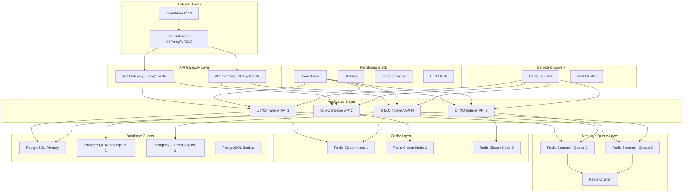
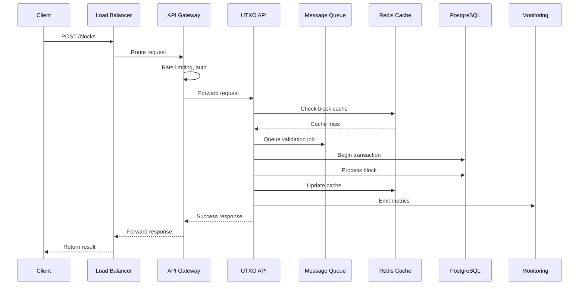
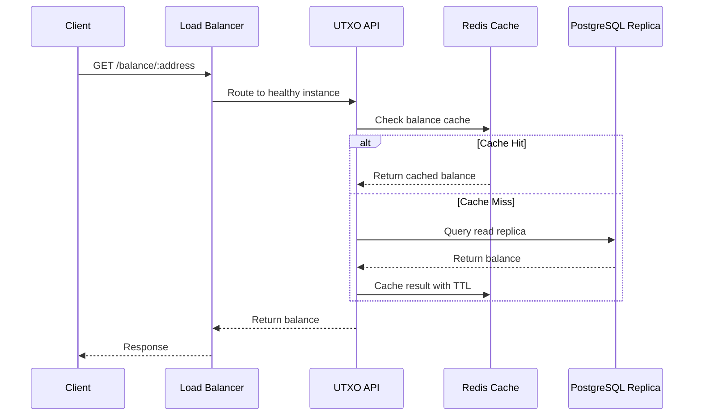

# UTXO Blockchain Indexer - Cluster Architecture

## 🏗️ Cluster Overview

This document outlines a production-ready cluster design for the UTXO blockchain indexer using modern middleware tools for high availability, scalability, and performance.

## 📐 Architecture Diagram

## 🛠️ Middleware Stack

### 1. **Load Balancer & Reverse Proxy**
- **HAProxy** - High-performance TCP/HTTP load balancer
- **NGINX** - Web server and reverse proxy
- **Traefik** - Modern reverse proxy with automatic service discovery

### 2. **API Gateway**
- **Kong** - API gateway with plugins ecosystem
- **Traefik** - Cloud-native API gateway with middleware
- **Envoy Proxy** - High-performance proxy for service mesh

### 3. **Message Queue & Event Streaming**
- **Apache Kafka** - Distributed event streaming platform
- **Redis Streams** - Lightweight message queuing
- **RabbitMQ** - Reliable message broker

### 4. **Caching Layer**
- **Redis Cluster** - Distributed in-memory cache
- **Memcached** - High-performance distributed memory cache
- **Hazelcast** - In-memory data grid

### 5. **Service Discovery & Configuration**
- **Consul** - Service discovery and configuration
- **etcd** - Distributed key-value store
- **Zookeeper** - Centralized service coordination

### 6. **Database Clustering**
- **PostgreSQL Streaming Replication** - Primary-replica setup
- **Patroni** - PostgreSQL cluster management
- **PgBouncer** - Connection pooling middleware

### 7. **Monitoring & Observability**
- **Prometheus** - Metrics collection and monitoring
- **Grafana** - Visualization and dashboards
- **Jaeger** - Distributed tracing
- **ELK Stack** - Logging and analytics

### 8. **Container Orchestration**
- **Kubernetes** - Container orchestration platform
- **Docker Swarm** - Native Docker clustering
- **Nomad** - Workload orchestrator

## 📊 Cluster Specifications

### **Production Cluster Layout**

| Component | Instances | Resources | Purpose |
|-----------|-----------|-----------|---------|
| Load Balancer | 2 | 2 CPU, 4GB RAM | HA proxy layer |
| API Gateway | 2 | 4 CPU, 8GB RAM | Rate limiting, auth |
| UTXO Indexer API | 4-8 | 8 CPU, 16GB RAM | Core application |
| Redis Cluster | 3 | 4 CPU, 8GB RAM | Distributed cache |
| PostgreSQL Primary | 1 | 16 CPU, 64GB RAM | Write operations |
| PostgreSQL Replicas | 2 | 16 CPU, 64GB RAM | Read operations |
| Kafka Brokers | 3 | 8 CPU, 32GB RAM | Event streaming |
| Monitoring | 3 | 4 CPU, 16GB RAM | Observability |

### **Development Cluster Layout**

| Component | Instances | Resources | Purpose |
|-----------|-----------|-----------|---------|
| Load Balancer | 1 | 1 CPU, 2GB RAM | Basic routing |
| UTXO Indexer API | 2 | 2 CPU, 4GB RAM | Development testing |
| Redis | 1 | 2 CPU, 4GB RAM | Simple cache |
| PostgreSQL | 1 | 4 CPU, 8GB RAM | Database |
| Monitoring | 1 | 2 CPU, 4GB RAM | Basic monitoring |

## 🔄 Data Flow Architecture

### **Block Processing Pipeline**

### **Balance Query Pipeline**

## 🚀 Deployment Strategies

### **Blue-Green Deployment**
- Zero-downtime deployments
- Full environment switch
- Instant rollback capability

### **Rolling Updates**
- Gradual instance replacement
- Continuous service availability
- Resource-efficient updates

### **Canary Releases**
- Gradual traffic shifting
- Risk mitigation
- Performance validation

## 📈 Scaling Strategies

### **Horizontal Scaling**
- Auto-scaling based on CPU/memory
- Load-based scaling triggers
- Kubernetes HPA integration

### **Vertical Scaling**
- Resource adjustment per component
- Performance optimization
- Cost efficiency

### **Database Scaling**
- Read replica scaling
- Connection pooling
- Query optimization

## 🔒 Security Architecture

### **Network Security**
- Private VPC/subnets
- Security groups/firewalls
- TLS termination at load balancer
- Internal service mesh encryption

### **Application Security**
- API rate limiting
- Authentication/authorization
- Input validation and sanitization
- SQL injection prevention

### **Infrastructure Security**
- Container image scanning
- Secrets management (HashiCorp Vault)
- Network policies
- Regular security updates

## 📊 Monitoring Strategy

### **Application Metrics**
- Request latency and throughput
- Error rates and success rates
- Block processing times
- Database query performance

### **Infrastructure Metrics**
- CPU, memory, disk usage
- Network I/O and latency
- Container resource utilization
- Database connection pools

### **Business Metrics**
- Blocks processed per second
- Transaction volume
- Address balance queries
- System uptime and availability

## 🎯 Performance Targets

| Metric | Target | Monitoring |
|--------|--------|------------|
| API Response Time | < 100ms (95th percentile) | Prometheus/Grafana |
| Block Processing | < 500ms per block | Application metrics |
| Database Query | < 50ms (95th percentile) | PostgreSQL metrics |
| Cache Hit Rate | > 90% | Redis metrics |
| System Uptime | 99.9% | Health checks |
| Throughput | 1000+ req/sec | Load testing |

## 🛠️ Implementation Phases

### **Phase 1: Core Cluster (Weeks 1-2)**
- ✅ Basic load balancing (HAProxy)
- ✅ Multi-instance API deployment
- ✅ PostgreSQL primary-replica setup
- ✅ Redis cache cluster
- ✅ Basic monitoring (Prometheus/Grafana)

### **Phase 2: Advanced Middleware (Weeks 3-4)**
- 🔄 API Gateway integration (Kong/Traefik)
- 🔄 Message queue implementation (Kafka)
- 🔄 Service discovery (Consul)
- 🔄 Advanced monitoring (Jaeger tracing)
- 🔄 Log aggregation (ELK stack)

### **Phase 3: Production Hardening (Weeks 5-6)**
- 🔄 Security implementations
- 🔄 Auto-scaling setup
- 🔄 Disaster recovery procedures
- 🔄 Performance optimization
- 🔄 Documentation and runbooks

### **Phase 4: Advanced Features (Weeks 7-8)**
- 🔄 Multi-region deployment
- 🔄 Advanced caching strategies
- 🔄 Machine learning insights
- 🔄 Real-time analytics
- 🔄 API versioning and governance

## 📋 Cluster Management

### **Health Monitoring**
- Service health checks
- Database connectivity monitoring
- Cache performance monitoring
- Network latency tracking

### **Backup & Recovery**
- Automated database backups
- Configuration backups
- Disaster recovery procedures
- Point-in-time recovery

### **Capacity Planning**
- Resource usage trends
- Growth projections
- Scaling recommendations
- Cost optimization

---

**Next Steps**: Implement specific middleware configurations for your chosen deployment environment (Kubernetes, Docker Swarm, or bare metal). 